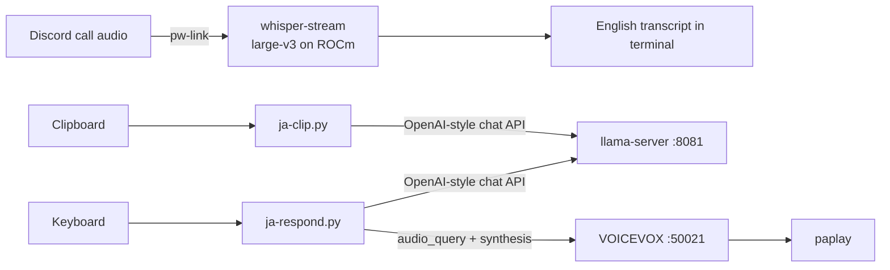

# jp-assist

Local Japanese helpers for Discord voice calls on Linux: live call transcription with whisper.cpp, plus two terminal translators backed by a local llama.cpp server.


Everything runs on the local machine. No cloud APIs.

## What it does

- **`start-whisper.sh`** runs `whisper-stream` (large-v3, auto language, translate to English) and keeps Discord's call audio patched into its input with `pw-link`, retrying every 3 seconds so calls started later are picked up. It unlinks the local microphone so only the other side of the call is transcribed.
- **`tools/ja-respond.py`** is a terminal prompt for replying in Japanese. Type English, get Japanese, romaji, a literal back-translation, a natural reading and a word-by-word breakdown. While typing it shows grey ghost-text completions from the LLM (Tab or Right arrow accepts). If a VOICEVOX engine is running, the Japanese line is spoken aloud; Ctrl+P replays it.
- **`tools/ja-clip.py`** watches the Wayland clipboard. When copied text contains kana or kanji it streams an English translation with a breakdown to the terminal and sends a desktop notification with the English line.
- **`tools/ja-launch.sh`** opens `ja-respond` as a floating 700x480 terminal on the monitor under the cursor in Hyprland (foot, kitty or alacritty).
- **`tools/test_voicevox.py`** checks the VOICEVOX pipeline end to end.

## How it works



The Python tools use only the standard library and talk to `llama-server` over `/v1/chat/completions` with streaming. TTS failures are ignored so the translator keeps working without VOICEVOX.

## Getting started

The scripts expect to live at the root of a [whisper.cpp](https://github.com/ggml-org/whisper.cpp) checkout (`start-whisper.sh` looks for `./build/bin/whisper-stream` and `models/ggml-large-v3.bin`). The build below targets an AMD RX 7900 XTX (gfx1100); change `AMDGPU_TARGETS` for other GPUs.

```bash
# inside a whisper.cpp checkout, with these files copied in
cmake -B build -DGGML_HIP=ON -DWHISPER_SDL2=ON -DAMDGPU_TARGETS=gfx1100
cmake --build build --config Release -j$(nproc)
bash ./models/download-ggml-model.sh large-v3

./start-whisper.sh              # transcribe the current Discord call
python3 tools/ja-respond.py     # English -> Japanese prompt
python3 tools/ja-clip.py        # clipboard watcher, Japanese -> English
python3 tools/test_voicevox.py  # check VOICEVOX + paplay
```

Runtime requirements:

- `llama-server` from llama.cpp listening on `127.0.0.1:8081` with a model that handles Japanese
- Optional: VOICEVOX Engine on `127.0.0.1:50021` (speaker 1 by default)
- PipeWire (`pw-link`, `paplay`), `wl-clipboard`, `libnotify`; `jq` and Hyprland for `ja-launch.sh`
- ROCm may need `HSA_OVERRIDE_GFX_VERSION=11.0.0` to recognise the GPU

Hyprland binding for the floating translator:

```
bind = SUPER, J, exec, ~/whisper.cpp/tools/ja-launch.sh
```

## Status

Personal tooling, used on one machine. Device names in `start-whisper.sh` (`WEBRTC VoiceEngine`, `Scarlett Solo USB`) and the GPU target are hardcoded for that setup.

## License

MIT. See [LICENSE](LICENSE).

---
<sub>Built by [Aladdin Ali](https://github.com/NaxeCode) · [naxecode.github.io](https://naxecode.github.io)</sub>
